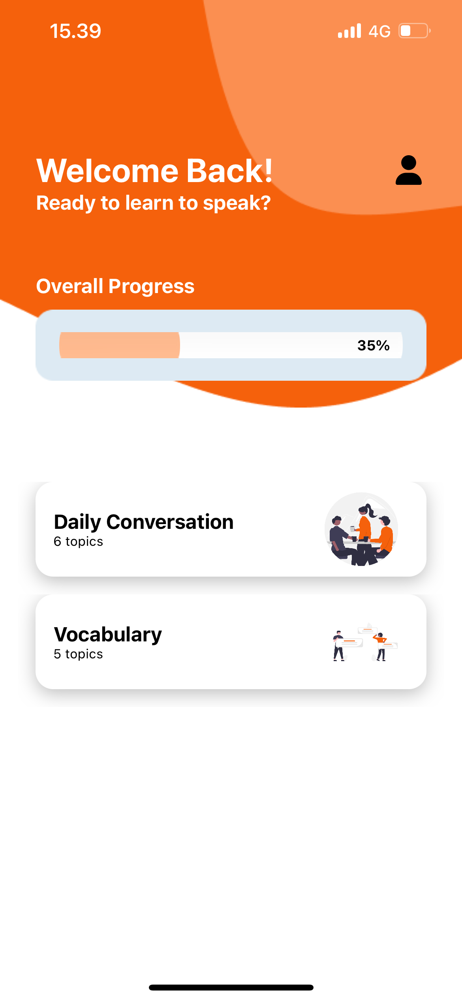
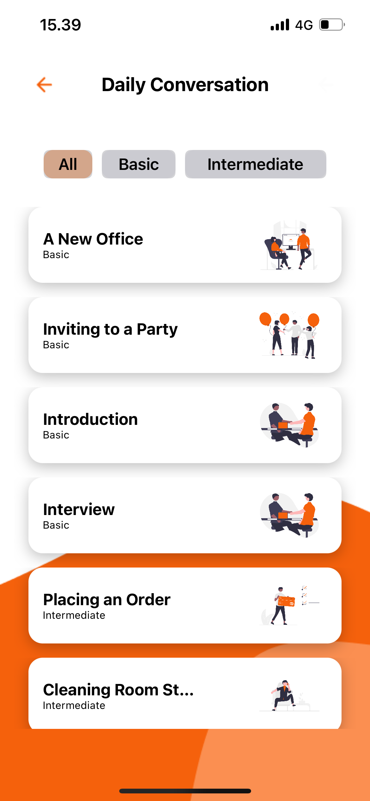
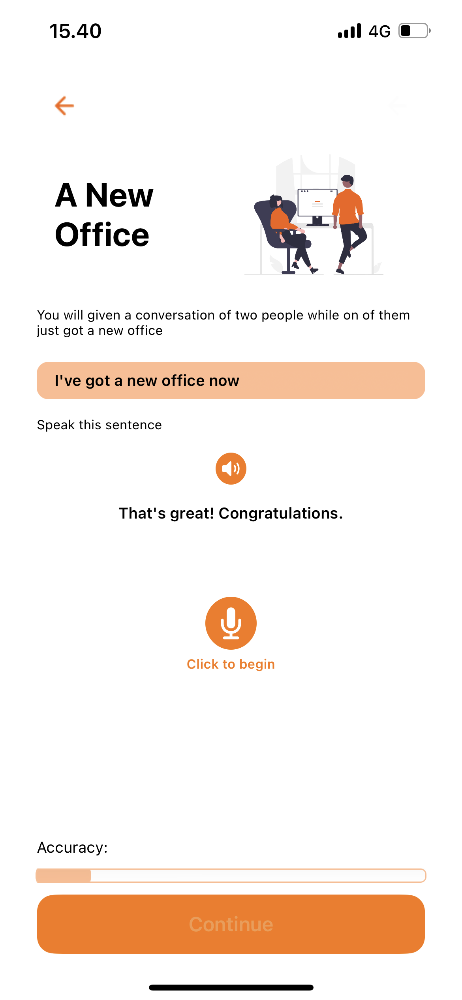
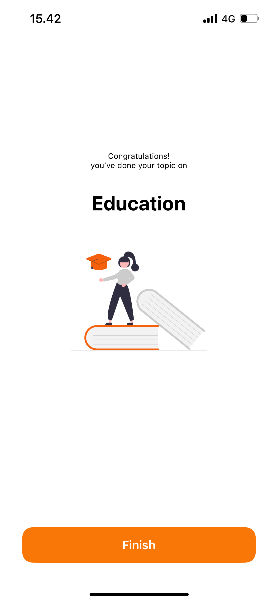

# SpeakIt
<br />
<p align="center">
    
  </a>
    
  <p align="center">
    SpeakIt is an iOS application that provides English-speaking learning with its features that can recognize the user's voice and convert it to text to learn how to speak English words and sentences. It also provides the accuracy of each speech recognition. This app was built on behalf of the final thesis project for the undergraduate bachelor.
  </p>
</p>


<p align="center">


  
  
</p>

## Features

- Progress tracker
- Play word/sentence example
- Speech recognition
- Speech accuracy

## Requirements

- iOS 15.0+
- Xcode 15.2

## Installation

### Xcode install

#### Manually
1. Download and drop ```SpeakIt.xcodeproj``` in Xcode.  
2. Run the app  

